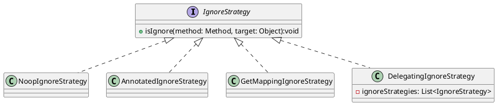
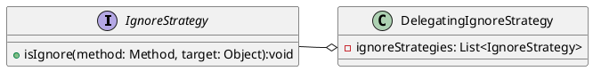
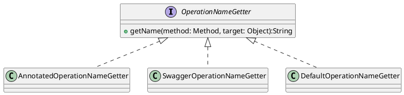

# 自定义操作日志收集

在[《操作日志收集》](/docs/project-docs/use/operation-log-collection)一文中提到了，操作日志的收集是通过注解 `@ServiceOperation` 来实现的。这样会有一个问题，那就是使用起来比较繁琐。对于开发规范要求比较严格的团队，完全可以通过监控控制层方法来实现日志的收集。如 `GET` 请求一般用于查询，那就拦截所有非 `GET` 请求。任何前端操作都是一定是要经过控制层的接口的，因此拦截控制层接口在加上注解来补充不经过控制层的方法也不失为一个好的方案。

下面我们看怎么来实现上述功能。

## 配置

在实现上述功能之前需要先了解下配置。

系统中通过 `org.dblue.application.config.OperationLogAdviceConfiguration` 来配置操作日志收集的 AOP 功能。

```java
@Configuration // <1>
public class OperationLogAdviceConfiguration {

    @Bean
    public Advisor serviceOperationAdvisor(Advice serviceOperationAdvice) {
        var pointcut = new AspectJExpressionPointcut();
        pointcut.setExpression("@annotation(org.dblue.core.aspect.ServiceOperation)"); // <2>
        return new DefaultPointcutAdvisor(pointcut, serviceOperationAdvice);
    }

    @Bean
    public Advice serviceOperationAdvice(
            OperationLogDomainService operationLogDomainService, ObjectMapper objectMapper,
            PlatformTransactionManager transactionManager) {
        return new ServiceOperationAdvice(operationLogDomainService, objectMapper, transactionManager);
    }
}
```

- [#1] 操作日志收集配置类，如果要禁用操作日志收集，删除此注解即可。直接删除此类也是可以的，但是不建议这样做。
- [#2] 这里配置切面，切面的配置细节可以参考官方文档：[《Declaring a Pointcut》](https://docs.spring.io/spring-framework/reference/core/aop/ataspectj/pointcuts.html)

需要注意的是，这里的 `Advisor` 和 `Advice` 都是可以配置多个的。

## 忽略策略

在 `ServiceOperationAdvice` 中可以配置忽略收集策略。



- `NoopIgnoreStrategy`: 不忽略任何方法
- `AnnotatedIgnoreStrategy`: 忽略方法上有 `@IgnoreOperation` 注解的方法
- `GetMappingIgnoreStrategy`: 忽略 `GET` 请求，`@GetMapping` 和 `@RequestMapping(method = RequestMethod.GET)` 都会被忽略。

`DelegatingIgnoreStrategy` 中包含了多个 `IgnoreStrategy`，其中任何一个判断结果为 `true`，对应方法都会被忽略。



默认使用的是 `NoopIgnoreStrategy` 即不会忽略任何方法。

## 操作名称获取策略



默认提供了两种操作名称获取策略。

- `AnnotatedOperationNameGetter`: 通过 `ServiceOperation` 获取。
- `SwaggerOperationNameGetter`: 通过 Swagger 注解 `@Operation` 中的 `summary` 字段获取接口名称。
- `DefaultOperationNameGetter`: 中包含了上面两个策略，如果通过这两个策略都没有获取到操作名称，则返回方法名称（`method.getName()`）。

默认使用的是 `DefaultOperationNameGetter`

## 拦截 Spring MVC 控制层方法

以本系统的包结构为例，拦截控制层方法的 pointcut 表达式如下：

```java
execution(public * org.dblue.application.module..controller..*.*(..))
```

将 pointcut 改为上面的表达式后即可拦截所有控制层方法。`GET` 请求一般用于查询，因此我们要忽略掉 `GET` 请求。则配置信息改为如下内容：

```java
@Configuration
public class OperationLogAdviceConfiguration {

    @Bean
    public Advisor serviceOperationAdvisor(Advice serviceOperationAdvice) {
        var pointcut = new AspectJExpressionPointcut();
        pointcut.setExpression("execution(public * org.dblue.application.module..controller..*.*(..))");
        return new DefaultPointcutAdvisor(pointcut, serviceOperationAdvice);
    }

    @Bean
    public Advice serviceOperationAdvice(
            OperationLogDomainService operationLogDomainService, ObjectMapper objectMapper,
            PlatformTransactionManager transactionManager) {

        ServiceOperationAdvice serviceOperationAdvice = new ServiceOperationAdvice(
                operationLogDomainService, objectMapper, transactionManager
        );
        serviceOperationAdvice.setIgnoreStrategy(new GetMappingIgnoreStrategy());
        return serviceOperationAdvice;
    }
}
```
## 混合拦截

混合拦截有多种配置方式，第一种是配置多个 `Advisor` 和 `Advice`；第二种是 pointcut 中使用 或(`||`) 连接多个切入点。本例中使用第二种方式（推荐）。

pointcut 表达式改为如下表达式即可：

```java
execution(public * org.dblue.application.module..controller..*.*(..)) || @annotation(org.dblue.core.aspect.ServiceOperation)
```

这样配置可能会出现冲突，比如控制层方法 `DepartmentController.add` 方法被拦截，而此方法又调用了 `DepartmentDomainServiceImpl.add` 方法，`DepartmentDomainServiceImpl.add` 也被拦截。

`ServiceOperationAdvice` 中做了防冲突处理，仅处理最外层的切面。


其实现原理是通过一个 `ThreadLocal<Context>` 来处理，`Context` 中存储最先进入此线程的方法。当另一个前置切面方法(`before`)进入时，会判断`ThreadLocal<Context>`中的 `Context` 是否已经创建，如果已经创建则不做任何处理。

```java {6}
protected void start(Method method) {
    if (contextThreadLocal.get() != null) {
        return;
    }
    this.timeConsumingThreadLocal.set(System.currentTimeMillis());
    this.contextThreadLocal.set(new Context(method));
}
```

当方法结束后，后置切面方法开始执行（`afterReturning`），这是需要判断 `Context` 中的方法与 `afterReturning` 中的方法是否是一致的，如果不一致，直接忽略处理，否则进行处理并清理 `ThreadLocal<Context>`。

```java {5,8}
@Override
public void afterReturning(Object returnValue, @NonNull Method method, @NonNull Object[] args, Object target) {
    // ...

    boolean isMe = this.getContext().isMe(method);

    // 嵌套处理
    if (isMe) {
        // ...记录操作日志
        this.clear();
    }
}
```

:::tip
这种方式如果在控制层方法上添加了 `@ServiceOperation` 注解并不会导致切面被多次执行的问题。但是如果配置了多个`Advisor` 和 `Advice` 则会出现同一个方法，对应的切面多次执行。这也是为什么推荐第二种配置方法的原因。
:::
